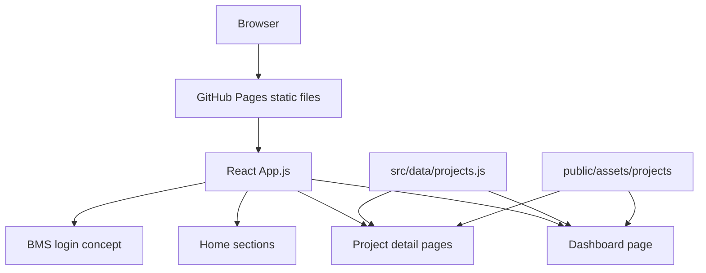
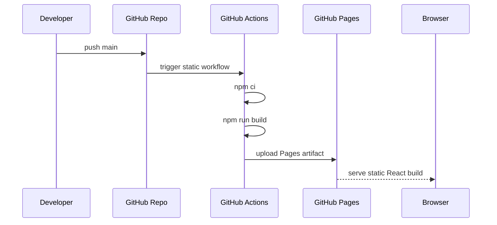

# Portfolio Architecture

## Purpose

This repository is a React portfolio for presenting GitHub projects, embedded
engineering work, full-stack experience, automation examples, and deployment
evidence. It is built as a static single-page app so it can run reliably on
GitHub Pages without a backend server.

The app is more than a landing page. It acts as a project catalog, project
detail viewer, evidence dashboard, and contact surface.

## Repository Map

```text
.
├── public/
│   ├── index.html
│   └── assets/projects/       Project screenshots, diagrams, and simulated views
├── src/
│   ├── App.js                 Hash routing and page composition
│   ├── App.css                Theme, layout, dashboard, detail, and responsive styles
│   ├── components/
│   │   ├── Dashboard.js       Portfolio command center and evidence matrix
│   │   ├── ProjectDetails.js  Detailed project case-study page
│   │   ├── Projects.js        Project card grid
│   │   ├── BmsLogin.js        BMS login concept page
│   │   └── shared sections
│   └── data/projects.js       Project catalog, links, evidence, architecture docs
└── .github/workflows/static.yml
```

## Application Flow



## Routing Model

The app uses hash-based routing to stay compatible with static hosting:

| Hash | View |
| --- | --- |
| empty hash | home page sections |
| `#dashboard` | portfolio dashboard |
| `#bms-login` | BMS login concept |
| `#project/<id>` | project case-study detail page |

`App.js` parses the hash and selects the active view. Project aliases allow
routes such as `#project/bms` or `#project/nms` to point at the same BEMS case
study.

## Data Model

`src/data/projects.js` is the central project catalog. Each project can define:

- `id`, `title`, `summary`, and `tags`
- repository and optional login route links
- deployment details and dependencies
- architecture summary and deep technical details
- features, outcomes, and resume bullets
- visuals and screenshot captions
- suggested future evidence captures
- `architectureDocs`, which link dashboard cards to Markdown files in each repo

Keeping the catalog in one file makes the dashboard, project cards, and detail
pages align automatically.

## Dashboard Architecture

`Dashboard.js` aggregates the project catalog into:

- portfolio-level KPI counters
- BEMS energy heat map and usage trend
- architecture Markdown matrix
- project readiness cards
- stack coverage tags
- project tag coverage
- visual evidence board
- suggested content queue

The dashboard is intentionally operational: it shows what exists, what is
documented, what evidence is simulated, and what should be captured next.

## Project Detail Architecture

`ProjectDetails.js` renders each project as a detailed case study:

- hero summary with metrics
- problem, architecture, and deployment brief
- numbered technical breakdown
- visual gallery with fallback behavior
- features and measurable outcomes
- repository and architecture doc links
- stack matrix
- interview-ready resume highlights
- evidence backlog

This turns each GitHub repo into a portfolio-ready engineering narrative without
duplicating content across components.

## Styling and Theme

`App.css` defines the theme tokens and page-specific layouts:

- `:root` light theme variables
- `[data-theme='dark']` dark theme variables
- responsive grid layouts
- project cards and case-study panels
- BEMS heat map states
- architecture documentation cards
- dashboard and detail view components

Theme preference is stored in `localStorage` and applied through the
`data-theme` attribute.

## Deployment Flow



## Validation Checklist

Before deployment:

```bash
npm run build
rg -n "<known-email-typo-patterns>" src public package.json README.md
```

Recommended evidence captures:

- desktop screenshot of home and dashboard
- mobile screenshot of dashboard and project detail
- GitHub Pages successful deployment run
- accessibility or Lighthouse report after final content pass

## Architecture Decisions

| Decision | Current Choice | Reason |
| --- | --- | --- |
| Framework | React / Create React App | Familiar component model and simple build pipeline |
| Hosting | GitHub Pages | Static portfolio deployment with GitHub Actions |
| Routing | Hash routes | Works without server rewrite rules |
| Content model | Central `projects.js` catalog | Keeps dashboard, cards, and details aligned |
| Visual evidence | Local assets plus GitHub previews | Gives each project inspectable images |
| Dashboard | Aggregated project evidence view | Makes architecture docs and capture gaps visible |
