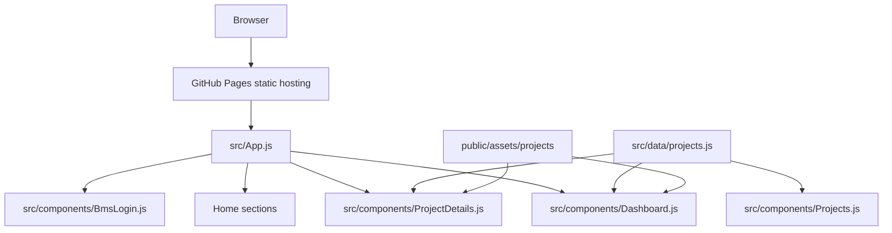
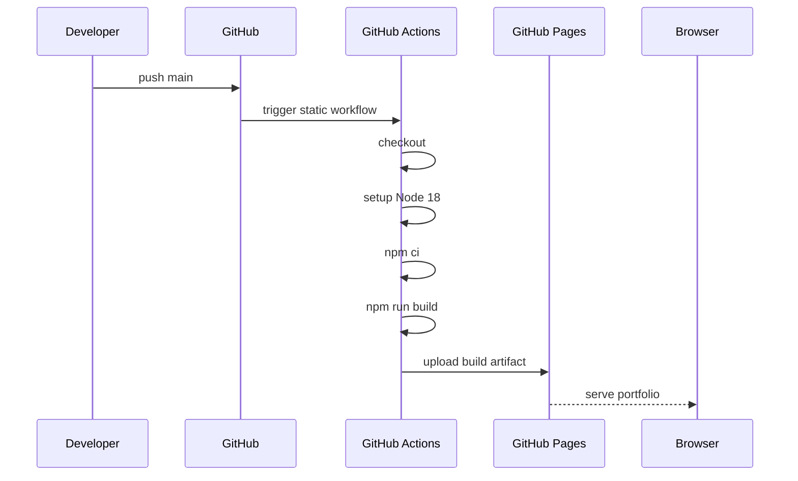

# Rheslar1-github.io Deep Details

## Purpose

`Rheslar1-github.io` is Robert Heslar's React portfolio and engineering project
catalog. It presents embedded engineering, full-stack development, React,
Node.js, MySQL, Yocto, embedded Linux, C/C++, Python, Ansible, building energy
management, and automation work through a static GitHub Pages site.

Live site:

```text
https://rheslar1.github.io/Rheslar1-github.io/
```

The repository is not only a landing page. It is a structured portfolio
application with:

- home sections for identity, experience, skills, selected projects, and contact
- a dashboard view for project evidence and architecture coverage
- detail pages for each project
- a BMS login concept view
- local visual assets and architecture diagrams
- a centralized project data model in `src/data/projects.js`
- GitHub Pages deployment through GitHub Actions

## Current Technical Snapshot

| Area | Current Choice |
| --- | --- |
| Framework | React 18 |
| Build tooling | Create React App / `react-scripts` |
| Package manager | npm with `package-lock.json` |
| Hosting | GitHub Pages |
| Routing | Hash-based static routing |
| Theme | Light/dark theme stored in `localStorage` |
| Content model | Central project catalog in `src/data/projects.js` |
| Deployment workflow | `.github/workflows/static.yml` |
| Main validation command | `npm run build` |

Recent verified behavior:

- `npm run build` compiles successfully.
- GitHub Pages workflow completes successfully.
- Live site returns HTTP `200`.
- Project detail pages are included in the published React bundle.
- Latest project data includes deep architecture and implementation details for
  all showcased repositories.

## Repository Map

```text
Rheslar1-github.io/
├── .github/workflows/static.yml       GitHub Pages deployment workflow
├── public/
│   ├── index.html                     Static HTML shell
│   └── assets/projects/               Screenshots, diagrams, simulated views
├── src/
│   ├── App.js                         Routing, theme state, page selection
│   ├── App.css                        Main application styling
│   ├── index.css                      Global browser reset/base styles
│   ├── index.js                       React root entry
│   ├── components/
│   │   ├── About.js                   Professional positioning
│   │   ├── BmsLogin.js                BMS secure-access concept page
│   │   ├── Contact.js                 Contact and social links
│   │   ├── Dashboard.js               Portfolio evidence dashboard
│   │   ├── Experience.js              Work/history narrative
│   │   ├── Footer.js                  Footer links and close
│   │   ├── Hero.js                    First viewport identity
│   │   ├── Navbar.js                  Navigation and theme toggle
│   │   ├── ProjectDetails.js          Project case-study renderer
│   │   ├── Projects.js                Project card grid
│   │   └── Skills.js                  Skills matrix
│   └── data/projects.js               Project catalog and case-study content
├── ARCHITECTURE.md                    Architecture overview
├── PROJECT_SUMMARY.md                 Portfolio and project summary
├── DEEP_DETAILS.md                    This detailed implementation document
├── CLOUD_DEPLOYMENT.md                Cloud deployment notes
├── PERFORMANCE_ANALYTICS.md           Performance and analytics notes
├── SETUP.md                           Local setup notes
├── README.md                          Repo entry point
├── package.json                       Scripts and dependencies
└── package-lock.json                  Locked dependency graph
```

## Application Runtime Flow



Runtime sequence:

1. Browser requests static files from GitHub Pages.
2. `public/index.html` loads the compiled React bundle.
3. `src/index.js` mounts `App`.
4. `App.js` reads the current hash route.
5. `App.js` loads theme preference from `localStorage`.
6. `App.js` renders one of the major views:
   - home page sections
   - dashboard
   - BMS login concept
   - project detail page
7. Project-driven views consume `src/data/projects.js`.
8. Visual galleries reference files in `public/assets/projects`.

## Routing Model

The app uses hash routes so GitHub Pages does not need server-side rewrite
rules.

| Route | Rendered view |
| --- | --- |
| no hash | Home page |
| `#dashboard` | Portfolio dashboard |
| `#bms-login` | BMS secure-access concept |
| `#project/<id>` | Project detail page |

Project aliases are supported. For example, the BEMS entry accepts aliases such
as `bms` and `nms`, so multiple hash routes can resolve to the same project
case study.

Routing responsibilities in `App.js`:

- parse `#project/<id>` into a selected project ID
- detect dashboard and BMS login routes
- respond to `hashchange`
- scroll to top for route-level page changes
- scroll to section anchors for normal home-page anchors
- pass selected project content into `ProjectDetails`
- reset project state when returning to the portfolio

## Theme Model

Theme state is controlled in `App.js`.

Current behavior:

- default theme is `light`
- saved theme is read from `localStorage`
- document theme is applied with the `data-theme` attribute
- `Navbar` receives the current theme and toggle callback
- the app can switch between light and dark visual systems without changing the
  route

Important files:

```text
src/App.js
src/App.css
src/components/Navbar.js
```

## Component Responsibilities

### `App.js`

`App.js` is the composition and route-selection root. It imports global content
sections, dashboard, project details, BMS login, and project data. It owns:

- current theme
- loading state
- selected project ID
- dashboard route state
- BMS login route state
- hash change listener
- selected project lookup

### `Dashboard.js`

`Dashboard.js` turns the project catalog into an operational evidence view. It
aggregates:

- portfolio-level KPI counters
- BEMS floorplan heat map
- BEMS usage trend
- BEMS-ai optimization readout
- architecture Markdown matrix
- project readiness cards
- stack coverage tags
- visual evidence board
- suggested content queue

The heat-map semantics are:

| Heat state | Color intent |
| --- | --- |
| cold | blue |
| normal | green |
| mid | orange |
| hot | red |

### `ProjectDetails.js`

`ProjectDetails.js` renders each project as a case-study page. It consumes a
single project object and renders:

- hero summary
- project tags
- repository link
- optional BMS login link
- stack/deep detail/case image/evidence counters
- problem, architecture, and deployment brief
- numbered technical breakdown
- image gallery with fallback handling
- features and outcomes
- architecture document links
- stack matrix
- resume-ready bullets
- evidence backlog

It also groups dependencies into categories using regex matchers:

- Frontend / UI
- Backend / API
- Data / Storage
- AI / Simulation
- Embedded / Native
- Automation / Deployment
- Additional Tools

### `Projects.js`

`Projects.js` renders project cards from `projects.js`. It is the entry point
from the main home page into the deeper case-study route.

### `BmsLogin.js`

`BmsLogin.js` is a concept page for BMS operator access. It ties together:

- secure BMS access
- role-based operator framing
- facility telemetry status
- API readiness
- BEMS-ai optimization status
- login-style interaction design

### Home Sections

The remaining components create the core portfolio narrative:

- `Hero.js`: first impression, identity, and call to action
- `About.js`: short profile and positioning
- `Experience.js`: professional history
- `Skills.js`: technical skill matrix
- `Contact.js`: GitHub, LinkedIn, and email links
- `Footer.js`: footer navigation
- `Navbar.js`: route navigation and theme toggle

## Project Data Contract

All project case-study content lives in `src/data/projects.js`.

Each project can define:

| Field | Purpose |
| --- | --- |
| `id` | Stable route and lookup key |
| `aliases` | Optional alternate route names |
| `title` | Display name |
| `summary` | Short project summary |
| `deployment` | How the project runs or deploys |
| `dependencies` | Stack items for the stack matrix |
| `repository` | GitHub repository URL |
| `architectureDocs` | Linked Markdown architecture documents |
| `loginRoute` | Optional internal route, used by BEMS |
| `loginLabel` | Label for optional internal route |
| `preview` | Primary image for cards |
| `visuals` | Gallery images and captions |
| `tags` | Short category chips |
| `problem` | Problem solved |
| `architecture` | Architecture summary |
| `deepDetails` | Numbered implementation details |
| `features` | Built feature list |
| `outcomes` | Measurable or inspectable results |
| `resumeBullets` | Interview-ready project bullets |
| `screenshotCaption` | Visual evidence explanation |
| `suggestedContent` | Evidence backlog |

The catalog currently includes:

- `pythonProject`
- `study`
- `BEMS-ai`
- `portfolio`
- `bems`
- `ansible`
- `CameraDemo`

## Project Inventory

### pythonProject

Purpose:

- compact Python CLI project for user and task-list management practice
- demonstrates command flow, domain modeling, and CSV persistence

Technical details:

- `main.py` owns the terminal menu and command routing.
- `Userclass.py` owns user identity behavior.
- `db.py` owns CSV read/write behavior.
- `users.csv` is the lightweight persistence boundary.
- Case-insensitive user-name equality introduces a simple domain rule.
- The architecture is ready to grow toward tests, repository interfaces,
  task-list objects, database storage, and a small API or UI.

Portfolio signal:

- Python fundamentals
- file-backed persistence
- separation of concerns
- upgrade path from CLI to API/database workflows

### study

Purpose:

- technical reference repo for C++17, UML, static analysis, CI, and embedded
  Linux notes

Technical details:

- examples cover RAII, Strategy, Factory Method, Observer, Dependency
  Inversion, lock guards, startup cleanup, sanitizer practice, and service
  lifecycle ownership.
- CMake and CTest provide a local build/test loop.
- clang-tidy, cppcheck, CodeChecker, and sanitizers provide static and dynamic
  analysis coverage.
- Draw.io sources and exported PNGs provide editable and portfolio-ready UML.
- Embedded notes connect C++ examples to ARM Linux, Yocto, systemd, reboot
  validation, upgrades, and rollback thinking.

Portfolio signal:

- disciplined C++ study practice
- analysis tooling
- diagram-driven engineering communication
- embedded deployment awareness

### BEMS-ai

Purpose:

- PPO-based building energy management controller with simulation, forecasting,
  digital-twin guardrails, grid-aware optimization, ONNX export, and C++
  deployment code

Core contract:

| Constant | Meaning |
| --- | --- |
| `STATE_DIM = 116` | Fixed state vector dimension |
| `ACTION_DIM = 12` | Fixed control action dimension |
| `N_ZONES = 4` | Multi-zone HVAC scope |
| `HORIZON_H = 8` | Forecast/control horizon |

Technical details:

- state vector includes per-zone features, global features, weather forecasts,
  price forecasts, and occupancy forecasts
- default simulation controller is `PpoBemsPolicy`
- `RuleBasedBaselinePolicy` remains as a non-AI comparison baseline
- power-grid optimizer models buy price, sell price, carbon intensity, grid
  stress, import limits, demand response, battery behavior, and solar
  export/curtailment
- training/export flow saves PPO weights, exports ONNX, validates ONNX
  inference, and preserves a C++ controller boundary
- BMS integration uses a service boundary instead of importing training scripts
  in request paths

Portfolio signal:

- AI control architecture
- simulation and forecasting
- Python/C++ deployment boundary
- ONNX portability
- building energy management domain modeling

### Rheslar1-github.io

Purpose:

- live portfolio and case-study system

Technical details:

- `App.js` handles hash routing and theme state
- `projects.js` is the single source of project content
- `Dashboard.js` aggregates project evidence
- `ProjectDetails.js` renders project case studies
- `BmsLogin.js` provides the BMS access concept
- GitHub Pages workflow builds and deploys static files

Portfolio signal:

- React implementation
- static-site deployment
- data-driven project pages
- UI polish and maintainable content model

### BEMS

Purpose:

- enterprise building energy management platform model integrating UI, API,
  MySQL, BEMS-ai, C++ edge services, BACnet, Docker, GitHub Actions, and Yocto

Technical details:

- React/Vite UI is the operator layer.
- Node API coordinates REST, auth, MySQL, gRPC AI, schedules, alarms, edge
  commands, and audit/event shaping.
- MySQL stores users, roles, buildings, zones, devices, telemetry, alarms,
  schedules, optimization history, and learned policy state.
- Python AI service exposes the BEMS-ai optimization boundary.
- C++ edge core handles BACnet-oriented device interaction and local control
  constraints.
- Docker stack verifies UI, API, AI service, edge-core, MySQL, Kafka, RabbitMQ,
  Prometheus, Grafana, Alertmanager, and Watchtower.
- Root GitHub Actions now run BEMS CI and BEMS CD from the repo root.
- CI passed on commit `4dbd8045` after cleaning checked-in CMake build caches
  before configure.

Portfolio signal:

- full-stack architecture
- embedded edge integration
- database-backed workflows
- AI service boundary
- Docker and CI/CD validation
- building automation domain depth

### ansible

Purpose:

- starter automation repository for local and remote execution patterns

Technical details:

- `test.yml` validates local connectivity.
- `helloworld.yml` validates baseline Ansible execution.
- `ssh_renmote_login.yml` demonstrates remote command execution, fact
  gathering, privilege escalation, command registration, and debug output.
- `ansible.cfg` defines inventory, host-key checking, retry file behavior, and
  remote temp path.
- Architecture separates control node, inventory layer, playbook layer, and
  module layer.
- Security notes identify IPs, usernames, SSH keys, topology logs, and
  privileged output as sensitive.

Portfolio signal:

- infrastructure automation
- SSH-based validation
- inventory discipline
- growth path toward roles, group vars, Molecule, ansible-lint, and deployment
  playbooks

### CameraDemo

Purpose:

- native C camera bring-up utility for embedded Linux targets such as Digi
  ConnectCore i.MX93 EVK

Technical details:

- direct V4L2 ioctl path opens `/dev/video0`
- queries capabilities and formats
- sets capture format
- requests streaming buffers
- maps buffers with `mmap`
- queues and dequeues frames
- tracks frame metadata with pointer, size, index, dimensions, and timestamp
- uses a four-buffer low-copy capture model
- includes framebuffer/DRM display hooks
- Makefile supports aarch64 cross-compile, SCP, SSH, run, clean, debug, and
  target overrides
- documented failure modes include missing camera node, unsupported format,
  insufficient buffers, mmap failure, missing display devices, SSH issues, and
  missing cross-compiler tools

Portfolio signal:

- low-level Linux C development
- V4L2 camera bring-up
- embedded target deployment
- direct hardware-interface troubleshooting

## Visual Asset Model

Project images live under:

```text
public/assets/projects/
```

The current visual set includes:

- simulated CLI screenshot for `pythonProject`
- simulated C++ CI workbench and service lifecycle image for `study`
- BEMS-ai architecture and RL control-loop visuals
- BEMS simulated dashboard, heat map, UML architecture, UML layers, and detail
  screenshot
- portfolio home screenshot
- Ansible simulated playbook output
- CameraDemo simulated capture console, detail screenshot, and architecture
  diagram

Visuals are referenced through:

```js
const projectAsset = (name) => `${process.env.PUBLIC_URL}/assets/projects/${name}`;
```

GitHub Open Graph previews are referenced through:

```js
const githubPreview = (repo) => `https://opengraph.githubassets.com/1/rheslar1/${repo}`;
```

## Deployment Flow

GitHub Pages deployment is defined in `.github/workflows/static.yml`.



Manual local deployment checks:

```bash
npm ci
npm run build
git status --short --branch
git push origin main
```

Workflow details:

- branch trigger: `main`
- manual trigger: `workflow_dispatch`
- permissions: `contents: read`, `pages: write`, `id-token: write`
- deployment environment: `github-pages`
- concurrency group: `pages`
- node version: `18`
- deploy action: `actions/deploy-pages@v5`

## Validation Checklist

Run before publishing:

```bash
npm run build
git diff --check
git status --short --branch
```

Content checks:

- verify `src/data/projects.js` still exports a valid project array
- verify every project has at least one repository URL
- verify every project has meaningful `deepDetails`, `features`, and `outcomes`
- verify visual assets referenced in `projects.js` exist in `public/assets`
- verify contact email values stay consistent
- verify BMS aliases still route to the BEMS project

Deployment checks:

- confirm latest Pages workflow succeeds
- confirm live site returns HTTP `200`
- inspect dashboard and at least one project detail page after content changes
- capture desktop and mobile screenshots after major content updates

## Known Risks And Maintenance Notes

### Dependency Health

GitHub Dependabot has reported vulnerabilities on the default branch. These are
dependency-management items, not content-build failures. They should be handled
in a separate dependency update pass.

Recommended approach:

1. Review Dependabot alerts.
2. Update compatible dependencies first.
3. Run `npm run build`.
4. Smoke-test dashboard and project detail routes.
5. Commit dependency changes separately from content changes.

### Content Drift

The portfolio pulls content from `src/data/projects.js`, while individual repos
also have architecture Markdown files. To prevent drift:

- update project repo architecture docs first
- update `PROJECT_SUMMARY.md`
- update `src/data/projects.js`
- build the portfolio
- deploy and confirm Pages success

### Visual Evidence Gaps

Some visuals are simulated by design. The current evidence backlog calls for:

- real CLI screenshots for `pythonProject`
- real C++ example output and CI screenshots for `study`
- pytest/CTest, PPO reward, ONNX validation, and before/after cost evidence for
  `BEMS-ai`
- real BMS dashboard, API responses, ERD, Docker health, and telemetry heat-map
  captures
- Lighthouse or accessibility results for the portfolio
- real Ansible run output
- real camera target output and hardware photos

## Recommended Future Enhancements

Short-term:

- add a direct link from the site dashboard to this `DEEP_DETAILS.md`
- add a small "last verified" field per project
- add real screenshots for BMS Docker dashboard and API responses
- add Lighthouse/accessibility evidence for the live site

Medium-term:

- add automated validation that every asset referenced in `projects.js` exists
- add route smoke tests for `#dashboard`, `#bms-login`, and each `#project/<id>`
- add JSON schema or TypeScript types for the project catalog
- split long project data into per-project files if the catalog grows further

Long-term:

- migrate from Create React App to Vite if faster builds or modern tooling are
  needed
- add structured evidence artifacts per project
- add a changelog that records when project details, screenshots, and deployment
  evidence were refreshed

## Quick Reference

Important files:

```text
src/App.js
src/components/Dashboard.js
src/components/ProjectDetails.js
src/components/BmsLogin.js
src/data/projects.js
src/App.css
PROJECT_SUMMARY.md
ARCHITECTURE.md
.github/workflows/static.yml
```

Important commands:

```bash
npm run build
git diff --check
git status --short --branch
```

Live URL:

```text
https://rheslar1.github.io/Rheslar1-github.io/
```
