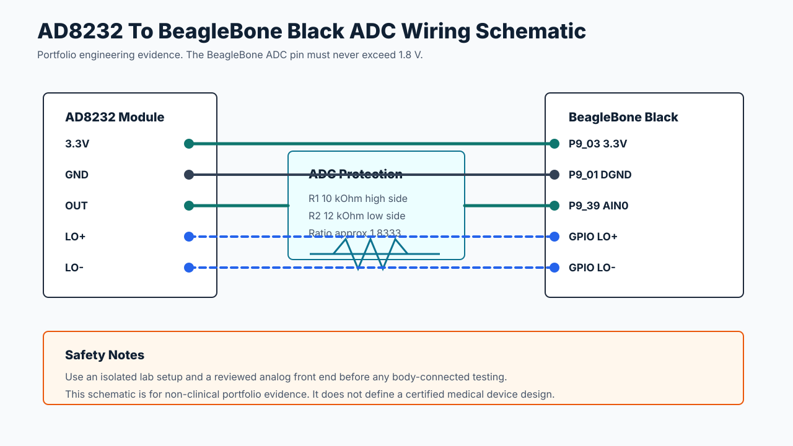

# AD8232 To BeagleBone Wiring

## Signal Mapping



| AD8232 Pin | BeagleBone Connection | Notes |
| --- | --- | --- |
| `OUT` | `AIN0` through safe divider/protection | BeagleBone analog inputs are 1.8V max. |
| `GND` | `DGND/AGND` | Keep analog ground clean. |
| `3.3V` | 3.3V supply if breakout supports it | Verify breakout requirements. |
| `LO+` | Optional GPIO input | Reports lead-off when high. |
| `LO-` | Optional GPIO input | Reports lead-off when high. |

## Voltage Divider

Many AD8232 boards can output up to the 3.3V supply range. BeagleBone Black AIN inputs must stay below 1.8V. A divider such as 10k/12k or another reviewed analog conditioning stage should be used before the AIN pin.

The driver's default `--divider-ratio 1.8333333333` maps a 1.8V ADC-side full scale back to an approximate 3.3V AD8232-side scale for reporting.

## Schematic Evidence

- `docs/schematics/ad8232-beaglebone-wiring.svg`: source schematic.
- `docs/schematics/ad8232-beaglebone-wiring.png`: rendered screenshot for portfolio review.

## Example Live Command

```bash
PYTHONPATH=src python3 -m ad8232_bbb_driver.cli \
  --duration-seconds 30 \
  --ain 0 \
  --iio-device /sys/bus/iio/devices/iio:device0 \
  --divider-ratio 1.8333333333 \
  --write-plot \
  --output-dir artifacts/ad8232-live
```
