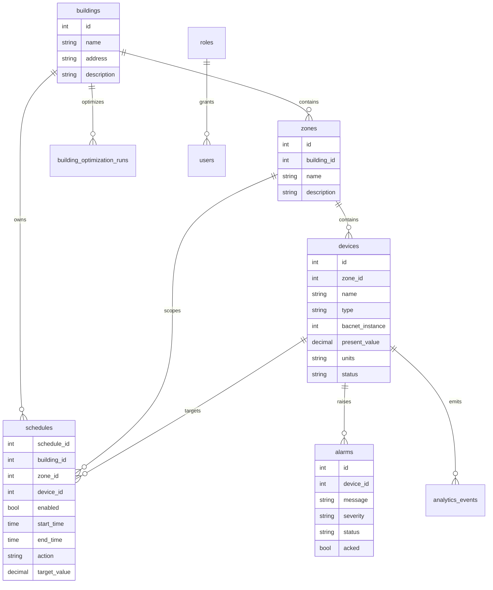

# Database ERD And Seed Data

Source: `BMS/BEMS_ENTERPRISE_COMPLETE/repo/database/schema.sql`

## Mermaid ERD

## Seeded Data Explanation

- Buildings: seeded with the primary BMS/BEMS building record.
- Zones: seeded to group rooms and device contexts under the building.
- Devices: seeded with BACnet-oriented device metadata, object identifiers, present values, units, status, and JSON configuration.
- Roles/users: seeded with Admin, Operator, and Viewer permissions for operations and dashboard access.
- Schedules: seeded for building, zone, and device-level control windows.
- Alarms: schema supports active, acknowledged, and cleared alarm lifecycle states.
- Analytics and optimization: `analytics_events` and `building_optimization_runs` preserve operational and AI evidence.

## Review Notes

The schema is intentionally small enough for local Docker startup but expressive enough to support hierarchy, devices, telemetry, alarms, schedules, users, roles, and optimization history.

