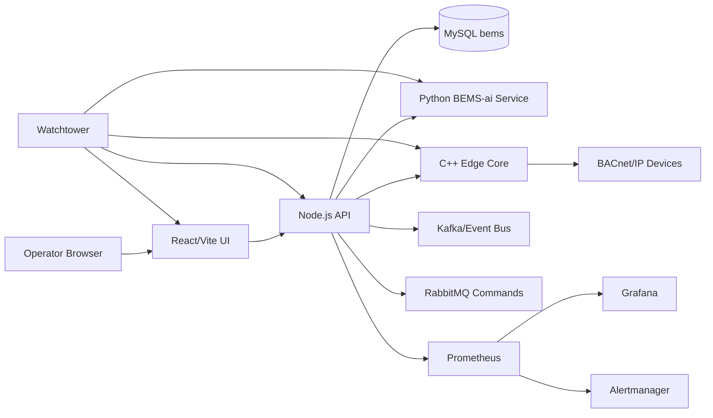

# Docker Compose Deployment Diagram

Source: `BMS/BEMS_ENTERPRISE_COMPLETE/repo/docker/docker-compose.yml`

## Service Roles

| Service | Role |
| --- | --- |
| UI | Operator dashboard. |
| API | REST/SSE gateway, auth/session, orchestration, persistence boundary. |
| DB | MySQL system of record. |
| AI service | Optimization and feedback engine. |
| Edge core | BACnet/control edge runtime. |
| Kafka/RabbitMQ | Event and command transport scaffolding. |
| Prometheus/Grafana/Alertmanager | Observability stack. |
| Watchtower | Container update automation. |

