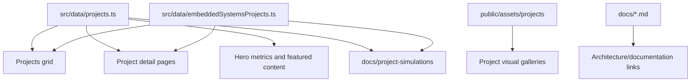

# Portfolio Content Governance

## Data Flow

## Project Data Rules

- `src/data/projects.ts` contains custom, high-detail project entries.
- `src/data/embeddedSystemsProjects.ts` generates scaffolded embedded-system case studies.
- Promote a generated project to `projects.ts` when it gains real code, screenshots, docs, or repo-specific evidence.
- Keep `architectureDocs` links stable and public.
- Keep `visuals` captions evidence-based.
- Keep `suggestedContent` as a backlog, not a claim that evidence already exists.
- Run `npm run simulate:projects` after adding or renaming projects so every catalog entry has regenerated JSON, SVG, and PNG simulation evidence.

## Review Checklist

- Project has a clear problem statement.
- Project has architecture/deployment/dependencies.
- Project links to source and docs.
- Project visuals are real screenshots, generated evidence, diagrams, or repository previews.
- Outcomes and resume bullets are supported by code/docs/evidence.
- `docs/project-simulations/README.md` includes the project in the generated artifact table.
