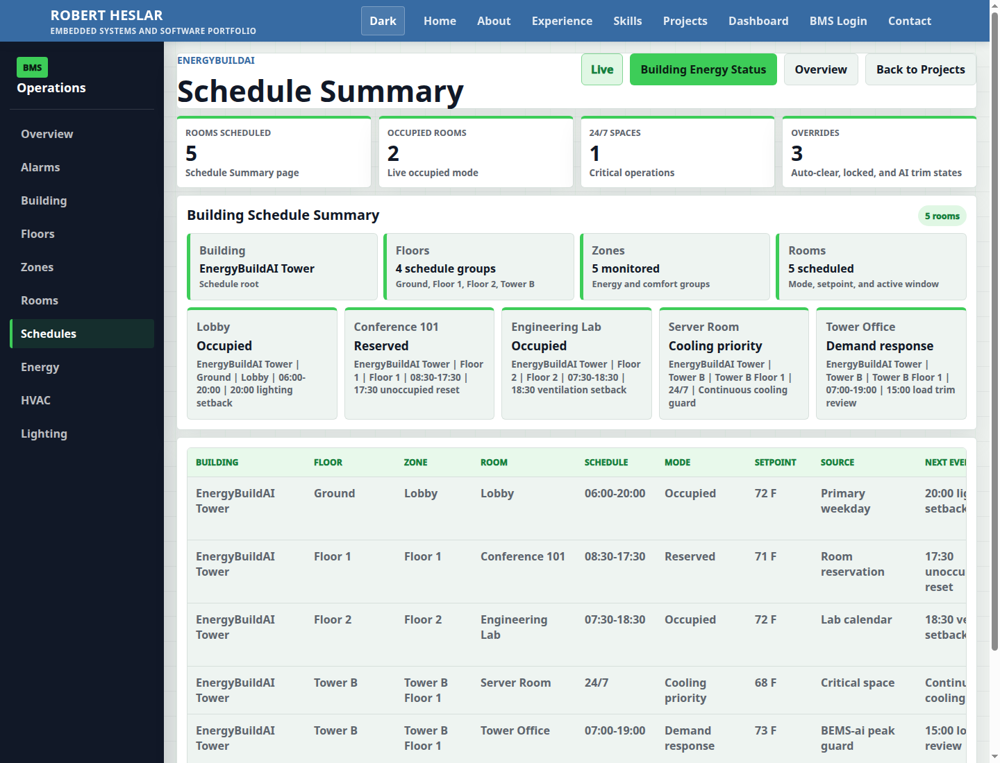

# EnergyBuildAI Schedules Live Proof

Evidence date: 2026-06-11

Live route checked:

```text
https://rheslar1.github.io/Rheslar1-github.io/#dashboard/schedules
```

Deployed build evidence:

| Item | Value |
| --- | --- |
| Git commit | `0b19326ce65e3bc9af40b1f9fb4dfa80bac97c33` |
| Pages workflow | `https://github.com/rheslar1/Rheslar1-github.io/actions/runs/27366952139` |
| Workflow status | `completed / success` |
| Deployed JS bundle observed | `main.c1a196ed.js` |
| Screenshot | `docs/evidence/energybuildai-schedules-live-proof.png` |

Live DOM verification:

| Check | Result |
| --- | --- |
| Page title contains `Schedule Summary` | Pass |
| Card title contains `Building Schedule Summary` | Pass |
| Old text `Building Schedule Details` is absent | Pass |
| Sidebar order is `Overview`, `Alarms`, `Building`, `Floors`, `Zones`, `Rooms`, `Schedules`, `Energy`, `HVAC`, `Lighting` | Pass |
| Sidebar hierarchy `Floors -> Zones -> Rooms` is in top-to-bottom order | Pass |
| Sidebar label `Schedules` is capitalized | Pass |
| Login page text `Secure BMS Access` is absent | Pass |

Captured screenshot:



Screenshot dimensions:

```text
1440 x 1100 PNG
```

Boundary:

This evidence proves the deployed static GitHub Pages route rendered the current seeded EnergyBuildAI schedule dashboard. It is not live building telemetry.
